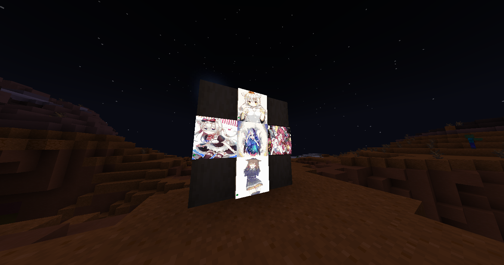

(Not too) Simple plugin to fetch and draw cute anime neko images on in-game maps.

The main idea behind this, is fun and give some anime servers (if they exist) something with they can decorate stuff and have fun with. Although that the main reason of this plugin, you're free of adding it to your server's plugin list indepently of what the server is.

Plugin works using the [nekos.life](https://nekos.life) API endpoints to get images, so if you have a outbound firewall add this site to the whitelist.

## Usage

To use the plugin, simply hold a filled map with something in your main hand and use the `/nget` command, a image of a neko will be applied to the map that you can use for decoration purposes.

Main permissions are `nekofetcher.nget` (/nget) and `nekofetcher.neko` (/neko), the last command is for help and reloading the plugin.

Here's a preview of how the maps looks with images applied in-game:

## To-do features 

- Add support for more APIs and sites like Safebooru maybe
- Add Vault support
- Make images persistent across restarts

*Yes, that's all*

## Compatibility and support

This plugin has only been tested and guaranteed to work on the Paper server software (latest Minecraft version), there's no guarantee or security that it will work on older Minecraft versions or different software.

## Compiling and installing

Firstly, make sure that you have Git and Java (JDK) installed.

Clone this repo using `git clone https://github.com/Vz0n/NekoFetcher`, then open a console on the source directory and run `./gradlew build` or `.\gradlew.bat build` depending of your operating system. Next drop the jar built in `build/libs/NekoFetcher-x.x.x.jar` on your server's `plugins` folder and restart.

You should have the plugin working now. Bugs can be reported on the issues section.

## License information

This plugins is licensed under the GPLv3 license, please read [LICENSE](https://github.com/Vz0n/NekoFetcher/LICENSE) for more information.

Copyright © 2024 Vz0n. All rights reserved.
